# Hacking Race: Problems with "ancestry reports"
 
_Biohacking Village DIY Workshops_
 
As part of our commitment to biohacking and open science, this 2019 DEF CON [Biohacking Village](https://www.villageb.io/)  workshop has been converted to a DIY/at home format. We hope you find this project instructive.
 
## About This Workshop
**Workshop leads:** @HerroAnneKim, Anvita Pandit, Bobby Hunt
 
Have you ever wondered how "race" and ancestry are "calculated" by 23andMe or Ancestry.com? Have you ever questioned why your results seemed so "wrong"? Well, in this workshop we'll be building our own admixture (ancestry) reports from publicly available data as well as showing how we can "hack race" to make racial results different.

[Original presentation - PPT](https://github.com/biohacking-village/2019BHV_hackingrace/blob/master/Hacking%20Race%20-%20Final.pptx)

[Original presentation - ODT](https://github.com/biohacking-village/2019BHV_hackingrace/blob/master/Hacking%20Race%20-%20Final.odt)

**Workshop Main Points**
> 1. Race is fake
> 2. Genetics testing for ancestry is limited
> 3. Don’t trust genetics testing companies!

**Workshop Goal**

By the end of this workshop you should have rudimentary knowledge of the genetics that go into a report and know how to build our own admixture (ancestry) reports as well as understand how those reports can be hacked to make racial results different. 
 
## Basics of Genetics
In order to understand this hack you will need to have a basic understanding of genetics. Hacking Race - Final.pptx

### DNA 
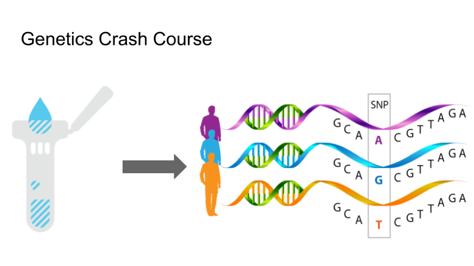 
* An individual’s genome is sequenced based off a DNA sample (spit works)
* 95% of that genome will be exactly the same as every other humans. The remaining 5% variation is very important for distinguishing that human
* We refer to the DNA variations as SNPs, there are other kinds of mutations but SNPs are most relevant for categorizing.
* Some SNPs are highly correlated within ethnic groups. Genetic information comes from our ancestors, but it gets scrambled (recombined) as it gets passed down. Example of an ethnic group: Han Chinese, Yoruba from Nigeria. 

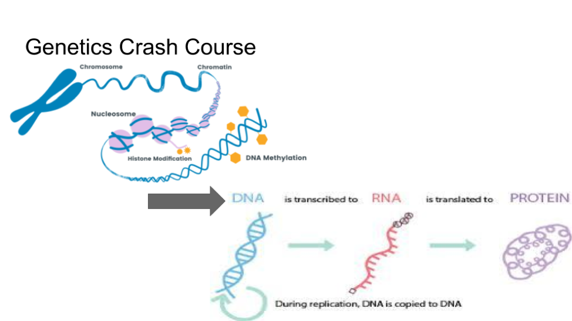 

* The phenotype (observable traits) is determined from the genotype and epigenome
* Regulatory DNA determines which genes in the genotype are enhanced in the resulting phenotype, and which ones are repressed.
* This is referred to as the effect size of a gene and is almost entirely empirically determined 

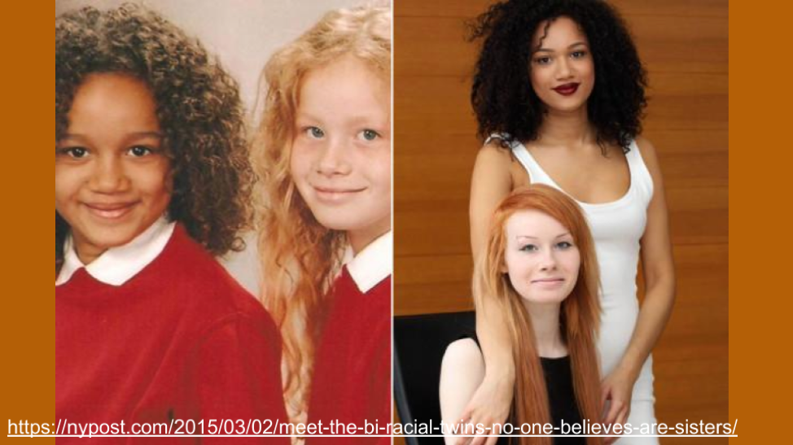 

These women are twins.

If people looked at them closely they would see a striking facial similarity between them. But because we use just a couple cues like hair texture and coloration as indicators of racial membership, we are prone to see these sisters as unrelated and unlikely to share the same parents. What is going on here? When we say that people are on average 50% related to each parent this really means that they have a 50% chance of inheriting any given allele that a parent has. Traits like hair texture and skin tone are complex traits governed by lots of different alleles.

During the process of recombination (whereby future parents produce unique eggs and sperm), and  then fertilization (where a specific sperm and egg combine), some siblings will end up with more light skin alleles and others with more dark tone alleles....just by chance. In fact most siblings will end up with middle-ish numbers of light and dark skin alleles in such a circumstance and look like these women's other siblings. Just to be clear, the daughter in this scenario that has lighter skin is not necessarily more likely to have more alleles from her white father than from her black mother in other parts of the genome. This is because different genes that are not linked (close to each other on chromosomes) will be inherited independently (independent assortment for anyone who remembers Mendelian genetics 101).

### Genetics Testing 

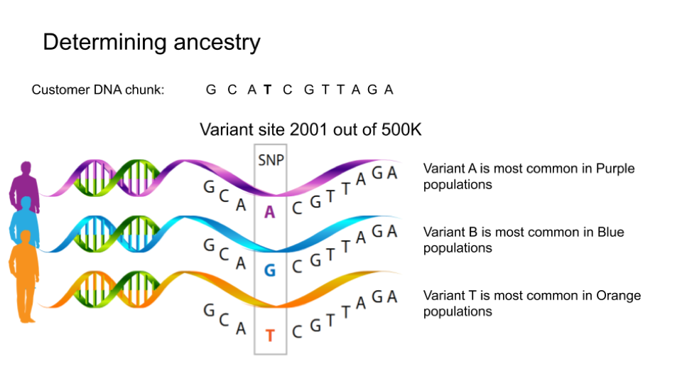 

With that understanding, let’s look at how genetics testing companies calculate your ancestry. They have access a proprietary panel of informative SNPs that differ between ethnicities. This panel is garnered from publicly available DNA sets with ancestry labels, but mostly it’s from their own customers, using self-reported ancestries. 23AndMe uses in total around 0.5M SNPs or about 0.016% of the genome, though Chinese researchers were able to tell the difference between Han Chinese and minority Uighur populations using only 35 SNPs (guess why they need to do that!). 

The genetics test splits up the customer DNA into very small chunks (to avoid running into a recombination event), and compares SNPs in each chunk to the SNP panel through a latent-state analysis, to retrieve the admixture. 

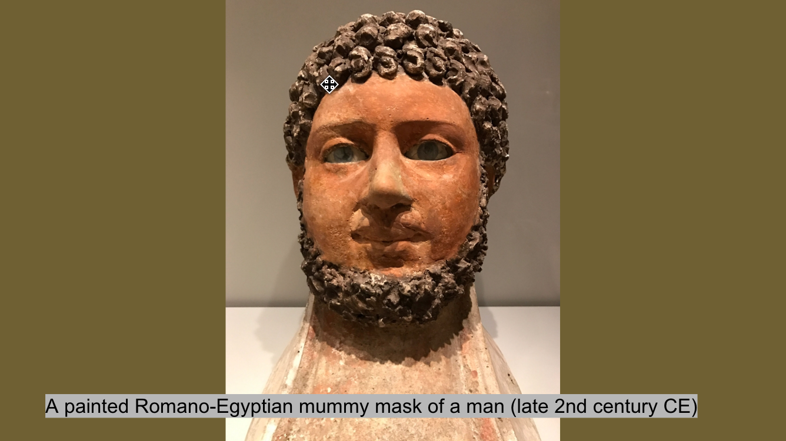 

Using unsupervised clustering on samples of DNA from different populations worldwide, geneticists can differentiate about 23 different human ancestries.  But there are several obstacles to determining ancestry labels for DNA samples. 
Due to heavy gene flow (the technical term for our ancestors having babies) throughout all 200,000 years of modern human history, the vast majority of individuals (97%) on all continents have some degree of mixed ancestry. That is, migration events in the distant past led to enough intermixing between populations that almost no one today belongs to just 1 of those 23 populations.
Additionally, the variance present between the populations is much smaller than the variance present between individuals locally. For example, me and another random south indian will have the same amount of DNA variance as me and Anne.

As an example of how there are no clear genetic categories for an individual, see this PCA clustering of a sample of 23AndMe’s customers in Europe, within a single continent. This is *after* careful selection of reference populations for each country - looking specifically for individuals with all four grandparents from a single region, who were not believed to have migrated within the last several hundred years.

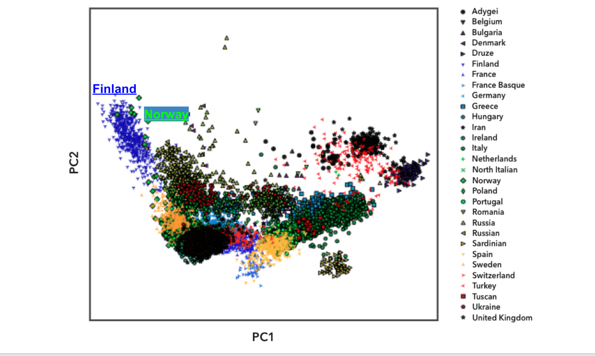 

You can see the variance within a population is very wide, and since most populations are overlapping, the distance between two populations is not as wide. It’s possible to clearly distinguish some populations from each other: see that the Finnish population on the far left side are outliers on the graph, due to their relative isolation from the rest of Europe. However, for any single individual, it’s unclear which population they might fall into because all the populations overlap to some extent - see that the green dots representing people from Norway overlaps partially with Finland. At best you could narrow it down to 2 countries.

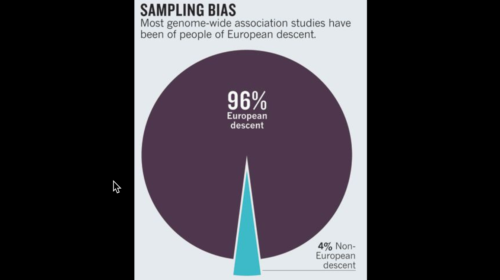 

The major social flaw with genetics testing: **23AndMe/Ancestry database is most popular with European White and Asian populations, so those segments have much richer data available. It’s also true of genetics datasets available to academia and governments: mostly European.**

Lack of data on other ancestries, like African or Indigenous American makes it difficult to determine the causes of genetic diseases in those populations, which hinders the development of therapies. Unfortunately the work of studies to identify genetic risk variants based on European databases will not fully translate to other non-European populations. 

**But adding more data will not solve ancestry profiling!** Ancestry testing will always be confounded by the fact that our ancestors engaged in multiple mass-migrations in the distant past, which have exponentially increased over the last several thousand years to current day.

**One great flaw with all DNA analysis:** It ignores the importance of effect size to the phenotype

References:

https://www.ncbi.nlm.nih.gov/pmc/articles/PMC3079573/: Genome wide association studies in European populations have issues with extending to non-European populations

https://www.23andme.com/ancestry-composition-guide/

https://www.nature.com/articles/475163a

------

## Materials (What you will need)

+ Computer 
+ You may need to install: plink, ugtm, numpy, scikitlearn, matplotlib
+ Access to the 1000 Genome dataset: https://www.genome.gov/27528684/1000-genomes-project/

## Experiment

Goal: Shift DNA sample from original ancestry to target ancestry

Method:

+ Cluster with all the data as normal
+ Score all the data against the sample data
+ Hack the data
  + From target ancestry data keep data that are closest to the sample
  + From original ancestry data remove data that are closest to the sample
+ Cluster again - this will shift the ancestry

## Instructions

Go to the the workshop lead's repository: https://github.com/herroannekim/hacking_race and follow the steps on the repo README page
The repo will guide you through set up (Step 0 to Step 3), clustering data (step 4), hacking data (step 5 and 6) and then clean up of environment (Step 7). 

Below is some help for steps 4-6. 

### Step 4: Run ancestry prediction and clustering

With the environment set up, you can now run a prediction on a sample, we chose [HG01108, a Puerto Rican female.](http://www.internationalgenome.org/data-portal/sample/HG01108)

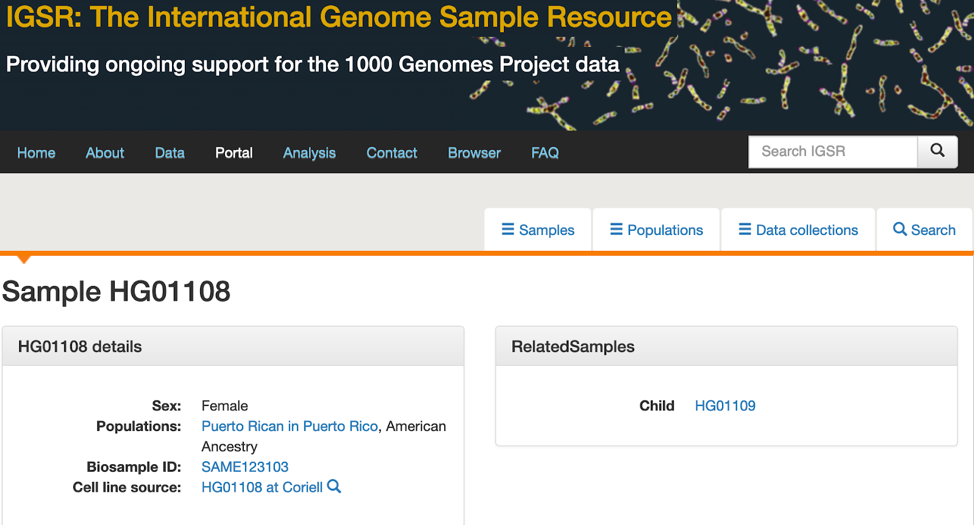

Use the command to cluster the data

> $ python2 hacker.py --model GTM --out classify_HG01108 --config ./standard_config.json --classify-id HG01108

The visual of the cluster will be provided in the output from the command running. In this example it is classify_HG01108.html.

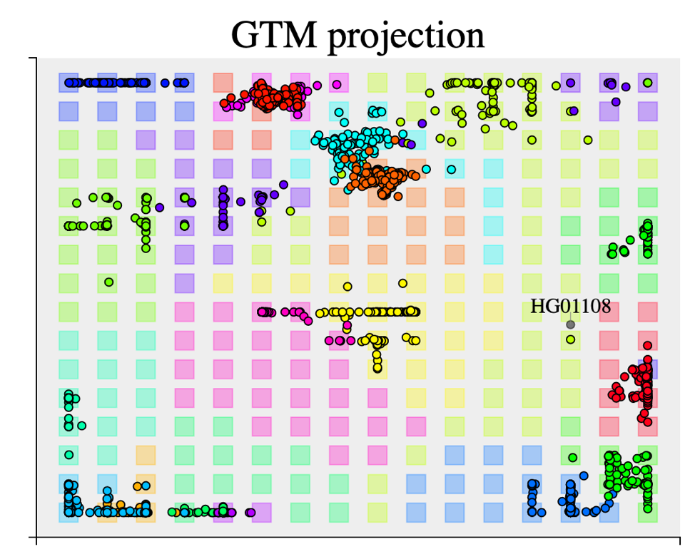

HG1108 Original Ancestry

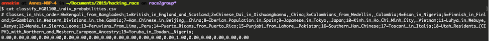

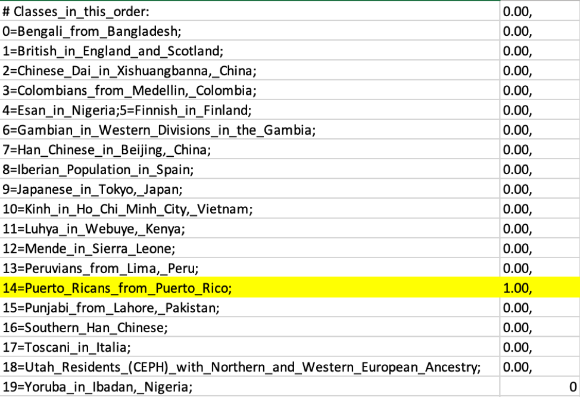

### Step 5: Hack

For the ancestry hack, we will now shift her ancestry towards Kenyan using the command:

> $ python2 hacker.py --model GTM --out kenya_dig_it --classify-id HG01108 --config ./standard_config.json --manipulate-towards "Luhya_in_Webuye,_Kenya" 

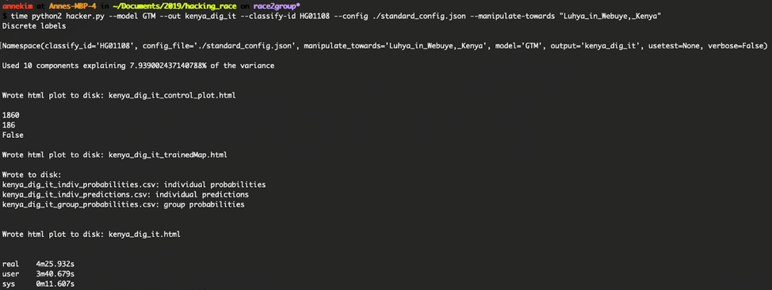

Hack - Visual via kenya_dig_it.html and kenya_dig_it_trainedMap.html

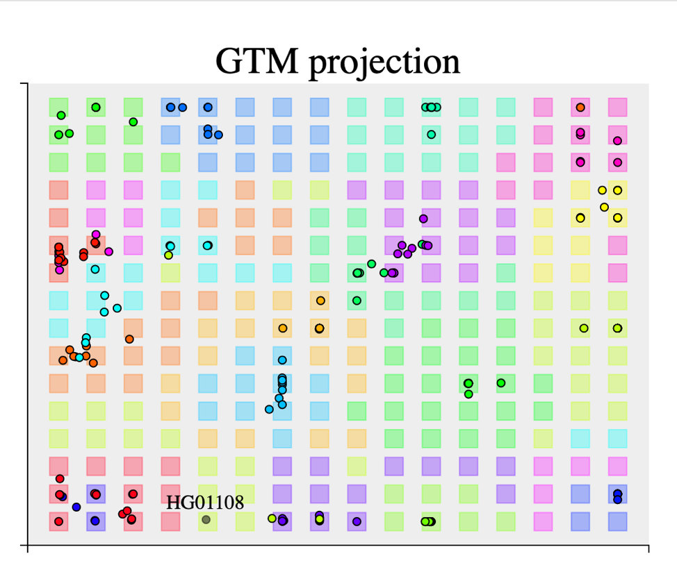 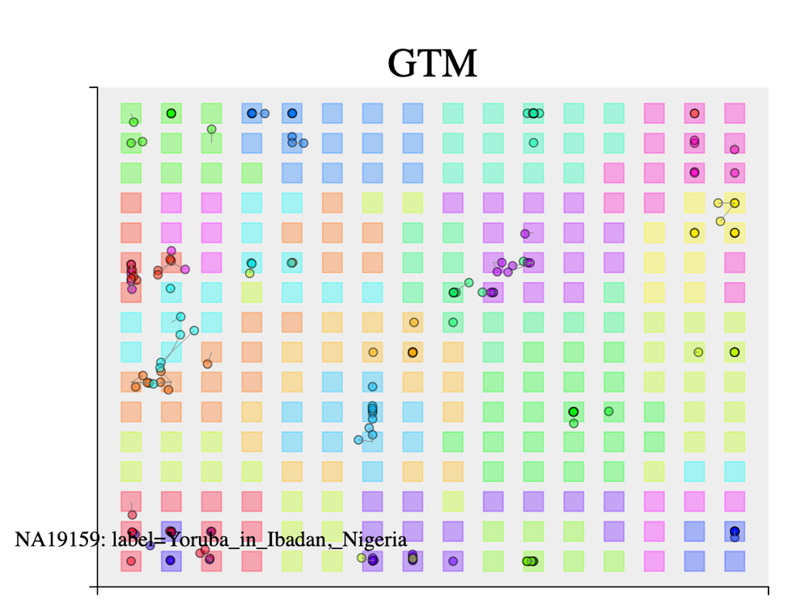  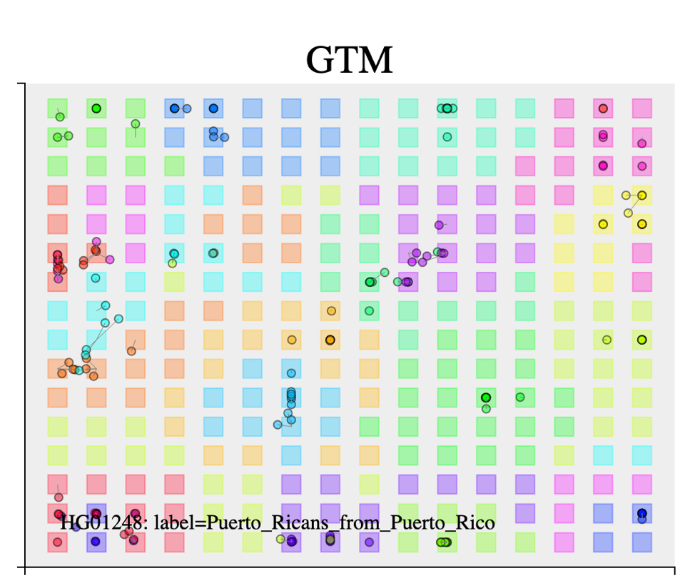

### Step 6: Check your work
Now you should be able to check the output and cluster graphs.

HG1108 Target Ancestry

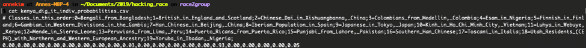
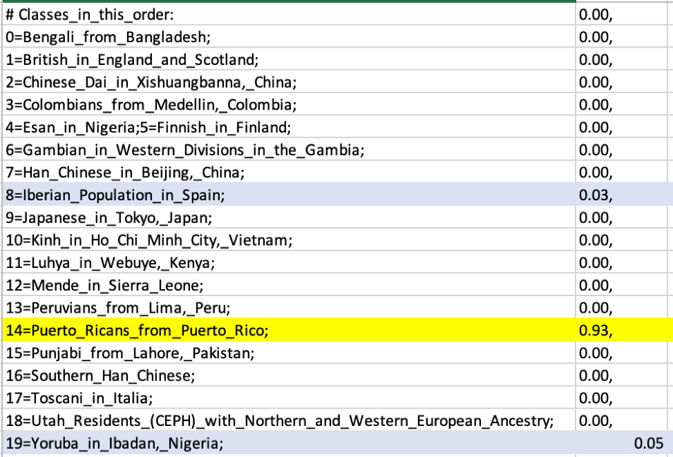

## Conclusion

**Please don’t put a lot of stock in the ancestry reports in direct-to-consumer genomics products.**

## Further Research 
**Research topic: Algorithmic fallibility**
+ t-SNE+DBSCAN does not preserve distance the way that PCA does 
+ This set, as well as the algorithm used is opaque to the public as it is considered proprietary to 23AndMe.

**Research topic:Social and Policy**
+ Who creates the SNP panel at genetic testing companies? At governments?
+ The selection of which SNPs to use as ethnicity markers will identify the placement of those races - literally determining ethnic boundaries. 

**Research topic: Ethical Use and Abuse**
+ In recent news, Chinese tracking minority Uyghur population. What is stopping the US and other countries do the same? 
DNA and ICE (US organization)
+ https://www.eff.org/deeplinks/2019/08/ices-rapid-dna-testing-migrants-border-yet-another-iteration-family-separation

## Resources

### Datasets
* https://www.genome.gov/27528684/1000-genomes-project/
* https://www.genome.gov/10001688/international-hapmap-project/
* UK Biobank
* https://my.pgp-hms.org/public_genetic_data?data_type=23andMe

### Code
* https://github.com/snehitp/cehg16-workshop 
* https://github.com/pcgoddard/Burchardlab_Tutorials/wiki/ADMIXTURE
* https://github.com/jacahill/Admixture
* http://www.y-str.org/2014/04/bam-analysis-kit.html
* https://github.com/pcgoddard/Burchardlab_Tutorials/wiki/ADMIXTURE
* https://pypi.org/project/admix/

### Literature
* Stamped from the Beginning, Ibrahm Kendi
* Cristina Moya at UC Davis
* 23AndMe ancestry composition explanation https://www.23andme.com/ancestry-composition-guide/ and whitepaper linked on site
* AAA Statement on Race https://www.americananthro.org/ConnectWithAAA/Content.aspx?ItemNumber=2583
* Anthropologists view on Race and Genetics https://onlinelibrary.wiley.com/doi/full/10.1002/ajpa.23120
* [Baker, 2017] Human ancestry correlates with language and reveals that race is not an objective genomic classifier https://www.ncbi.nlm.nih.gov/pmc/articles/PMC5431528/
* [Templeton 2013] Biological Races in Humans https://www.ncbi.nlm.nih.gov/pmc/articles/PMC3737365/
* TechCrunch https://techcrunch.com/2019/01/18/dna-testing-twin-results-show-why-you-should-take-dna-analysis-with-a-grain-of-salt/

### Other
* "ADMIXTURE is a program for estimating ancestry in a model-based manner from large autosomal SNP genotype datasets, where the individuals are unrelated (for example, the individuals in a case-control association study)."
* http://software.genetics.ucla.edu/admixture/admixture-manual.pdf: 
* https://genome.cshlp.org/content/19/9/1655.short
* https://journals.plos.org/plosgenetics/article/authors?id=10.1371/journal.pgen.1000519
* https://journals.plos.org/plosone/article/authors?id=10.1371/journal.pone.0032840
* Ancestry testing uses SNP variant testing https://ghr.nlm.nih.gov/primer/dtcgenetictesting/ancestrytesting
* GTM and t-SNE classification and clustering of 1000 Genomes Project populations https://github.com/hagax8/ancestry_viz
* Worldmap visualization of 1000Genomes data https://lovingscience.com/ancestries/… 
* The end of the start for population sequencing https://www.nature.com/articles/526052a
* List of resources: https://www.livinganthropologically.com/race-is-a-social-construction/
